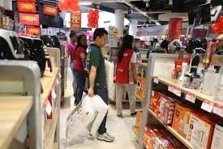
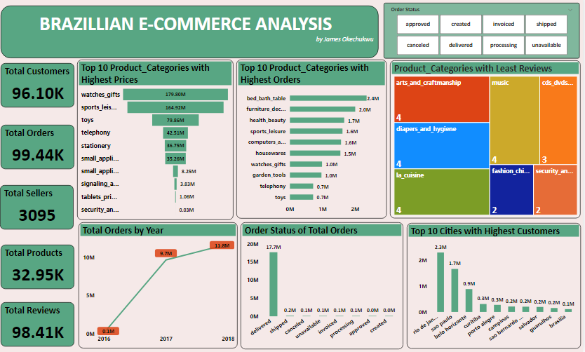
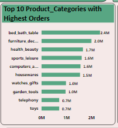

# Brazilian_E-commerce_Analysis_Power_BI
Brazilian E-Commerce data set is provided by Olist stores in Brazil

           

## Introduction:
This is a power BI project for **Brazilian E-commerce Store**. The dataset was provided by Olist and it gives a rich information for analysing the online  retail market in Brazil. It contains over 90,000 orders with 18,188,958 rows from 2016 to 2018.

## Problem Statement:
1. What is the order variation over the course of 3 years
2. Which city had the highest customer base (e-commerce subscribers)
3. Which product category has the highest price
4. Which product category had the highest order

## Skills/concept demonstrated:

The following Power BI features were deployed
- Merging
- Modelling
- Filters and
- Page navigation

## Modelling:
Relationships between the customer dataset and product dataset was derived to give a Merge 1/consolidated dataset.
The product data was merged to the customer data with a one-to-many relationship.

## Visualization:

The report comprises of 11 insights which are:
- Total Customers
- Total Orders
- Total Sellers
- Total Products
- Total Reviews
- Product categories with highest prices
- Product categories with highest orders
- Total orders by Year
- Order status
- Cities with the highest customers
- Product categories with the least reviews

You can preview the dashboard here 

You can also interact with the dashboard [here](https://app.powerbi.com/groups/me/reports/fe5c084e-737f-483c-881e-399663b4207c?experience=power-bi)

## Analysis:

### Order Variation:
The total orders increased from 100k to 11.8M orders from 2016 to 2018 which shows that more people subscribed to e-commerce stores over the years

### Cities with highest customer base
Rio de Janeiro and Sao Paulo recorded the highest customer base with about 2.3M and 1.7M  customers respectively

### Product Categories with the highest price
Watches_gift, sports_leisure and toys are the product categories with the highest prices

### Product Categories with the highest order
Bed_bath_table, furniture_decor, health_beauty and sports_leisure had the most oders over years which shows customer preference and behaviour to available products.

### Conclusion
Rio de Janeiro and Sao Paulo had the highest e-commerce subscribers, therefore investors and entrepreneurs should consider these two cities for an e-commerce start-up smile

### Recommendation
Products which had the lowest orders also had the lowest reviews, hence, a potential customers' pain points and should be evaluated to see why the reviews are low.

:----------------------------------------------------

 
